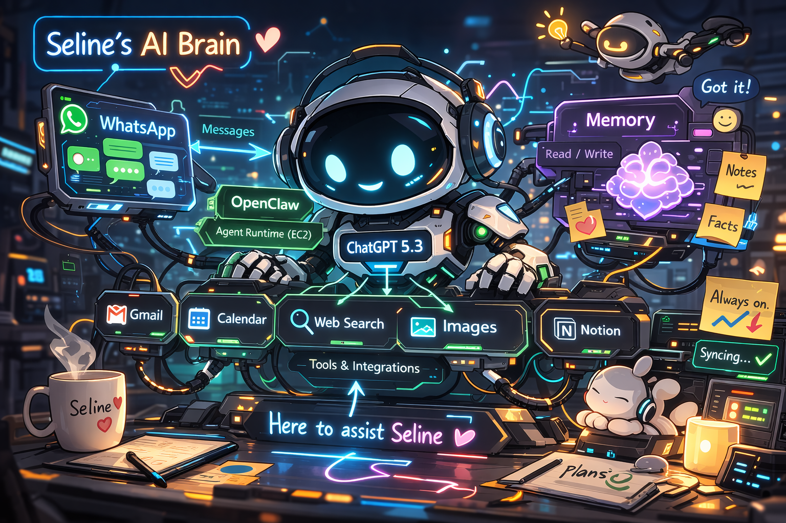
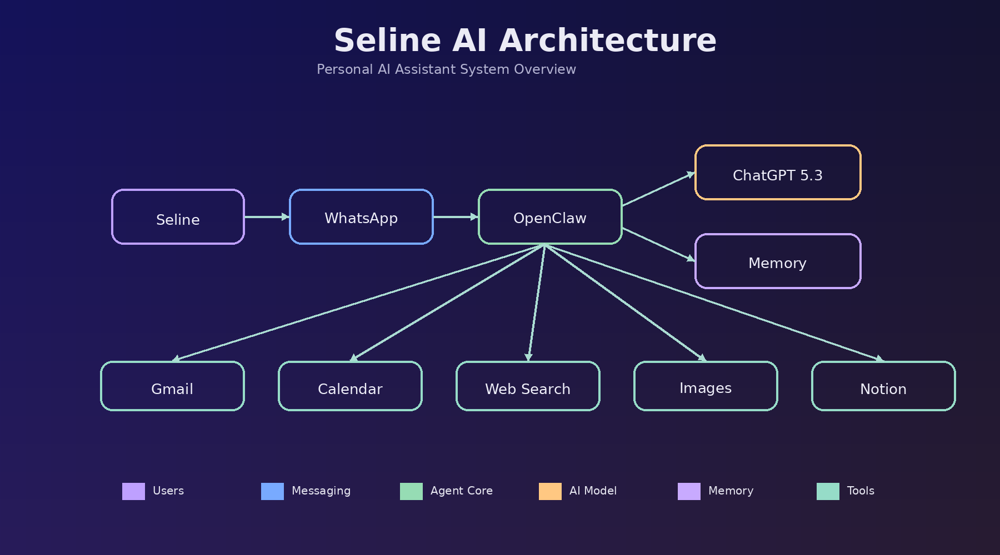

# BER Mecha Agent v1 — Multi-channel AI Automation System

## 🚀 Overview
This is my first multi-channel AI automation agent.

The project was built not only as a portfolio for job applications, but also as a personal tool to improve my own workflow — managing information, processing emails, and supporting daily decisions.

Instead of creating a single script, I focused on building a connected system by integrating multiple tools such as Gmail, Notion, and WhatsApp.

This is an evolving project that I will continue to iterate and expand as I move deeper into AI and automation.

---

## 🧠 What it does

- Fetch unread emails from Gmail
- Filter out already processed emails using labels
- Structure email data for further AI processing
- Apply automated labeling logic
- Store results into Notion for tracking and logging
- Enable interaction and control via WhatsApp
- Connect multiple tools into a unified automation workflow

---

## ⚙️ System Architecture

ChatGPT (LLM / decision layer)  
→ OpenClaw (workflow orchestration)  
→ Python (execution logic)

Connected channels:

- Gmail (data input)
- Notion (data storage & logging)
- WhatsApp (interaction & control)

OpenClaw acts as the orchestration layer, coordinating multiple tools and managing execution flow across the system.

The agent follows a basic loop:

Input → Process → Decide → Execute → Store

---

## 📂 Key Components

- `gmail_assistant.py`  
  Handles Gmail authentication, email fetching, filtering, and labeling logic

- OpenClaw workflow  
  Core orchestration layer connecting all tools and controlling execution flow

- Notion integration  
  Used for logging and structured data storage

---
## 🧩 Implementation Note

This project is not purely code-based.

The system is composed of:
- Python scripts (for email processing logic)
- OpenClaw workflows (for automation orchestration)
- External tool integrations (Gmail, Notion, WhatsApp)

On top of that, I also made some adjustments to the underlying configuration and parts of the OpenClaw codebase to better fit my use case.

As a result, much of the logic is distributed across workflow configuration, system integration, and selective  modifications, rather than being concentrated in a single code file.

## 💡 Why I built this

I am transitioning from a business / e-commerce background into AI and automation.

Instead of only learning theory, I chose to build real systems to:

- Understand how AI connects with real-world tools
- Develop system design and orchestration thinking
- Improve execution and engineering capability
- Create practical, demonstrable experience

---

## 🛠 Tech Stack

- Python
- Gmail API
- Notion API
- OpenClaw (workflow orchestration)
- LLM (ChatGPT)
- JSON / API integration
- Automation workflow design

---

## ⚠️ Notes

Sensitive files such as credentials and tokens are excluded for security reasons.

---

## 📈 Next Steps

- Move to cloud deployment for better stability
- Replace local logic with API-based architecture
- Improve LLM-based classification
- Expand to more channels (e.g., Slack, Webhooks)
- Build a more robust agent system

---
## 🧩 Architecture Diagram

## 👤 Author

Jiayue Li (Seline)  
Transitioning into AI / Automation
